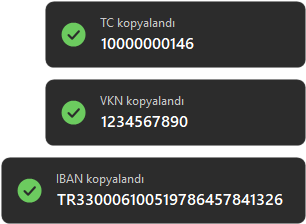

<p align="center"></p>

<h1 align="center">Test Veri Üretici</h1>

<p align="center">
Sistem tepsisinden tek tıkla geçerli <b>TC Kimlik No</b>, <b>VKN</b> ve <b>IBAN</b> üretip panoya kopyalayan küçük bir Windows uygulaması.
</p>

<p align="center">
<a href="https://apps.microsoft.com/detail/9P3MTW3K1BQD"><b>Microsoft Store'dan yükle</b></a> ·
<a href="https://github.com/alperennkls/TestVeriUretici/releases/latest"><b>⬇ İndir (TestVeriUretici.exe)</b></a>
</p>

---

Saatin yanındaki ikona **sağ tıkla**, **TC üret**, **VKN üret** veya **IBAN üret**'i seç. Kontrol haneleri doğru bir değer üretilir ve **panoya kopyalanır**; istediğin alana `Ctrl+V` ile yapıştırırsın. SAP, ERP, e-fatura ve form testlerinde geçerli görünen test verisine ihtiyaç duyanlar için.

<p align="center"></p>

## Kurulum

**Microsoft Store (önerilen):** [Test Veri Üretici](https://apps.microsoft.com/detail/9P3MTW3K1BQD) sayfasında **Yükle**'ye bas. Store'dan kurulumda Windows uyarısı çıkmaz ve güncellemeler kendiliğinden gelir.

**Ya da exe olarak:**

1. [Releases](https://github.com/alperennkls/TestVeriUretici/releases/latest) sayfasından `TestVeriUretici.exe`'yi indir.
2. İstediğin bir klasöre koy ve çalıştır. İkon saatin yanına yerleşir ve "Test Veri Üretici çalışıyor" bildirimi çıkar. Kurulum gerekmez; Windows 10 ve 11'de hazır gelen .NET Framework ile çalışır.
3. Bilgisayar her açıldığında kendiliğinden başlasın istersen menüden **Windows ile başlat**'ı işaretle.

> [!NOTE]
> Exe kod imzalı olmadığı için ilk açılışta **"Windows kişisel bilgisayarınızı korudu"** uyarısı çıkabilir. **Ek bilgi → Yine de çalıştır** ile açabilirsin. İstersen indirmek yerine [kaynaktan kendin derleyebilirsin](#kaynaktan-derleme).

### İkon görünmüyorsa

Windows 11'de exe sürümü ilk açılışta ikonunu kendiliğinden saatin yanına yerleştirir; ikonu sonradan gizlersen bu tercihine dokunmaz. Store sürümünde Windows kuralları buna izin vermez: ikon ilk açılışta **^** okunun altında olur ve açılış bildirimi bunu söyler. Windows 10'da, Store sürümünde ya da ikonu gizlediysen **^** okunun altına bak, oradan saatin yanına sürükleyebilirsin.

## Menü

| Seçenek | Ne yapar |
|---|---|
| **TC üret** | 11 haneli TC Kimlik No üretir ve kopyalar |
| **VKN üret** | 10 haneli Vergi Kimlik No üretir ve kopyalar |
| **IBAN üret** | 26 karakterlik, boşluksuz TR IBAN üretir ve kopyalar |
| **Windows ile başlat** | Bilgisayar her açıldığında uygulamayı sessizce başlatır (Store sürümünde Ayarlar → Uygulamalar → Başlangıç'ta da görünür) |
| **Çıkış** | Uygulamayı kapatır |

Kopyalanan değer sağ altta kısa bir bildirimle gösterilir. Bildirim odağı çalmaz, çalıştığın pencerede kalırsın.

## Değerler nasıl üretiliyor?

- **TC Kimlik No:** İlk hane 0 olamaz. 10. hane = ((1, 3, 5, 7, 9. hanelerin toplamı × 7) − (2, 4, 6, 8. hanelerin toplamı)) mod 10. 11. hane = ilk 10 hanenin toplamı mod 10.
- **VKN:** Gelir İdaresi'nin kontrol hanesi algoritması. İlk 9 hanenin her biri sırasına göre kaydırılıp 2'nin kuvvetleriyle (mod 9) ağırlıklandırılır; son hane, toplamı 10'un katına tamamlayan rakamdır.
- **IBAN:** `TR` + 2 kontrol hanesi (ISO 7064 mod 97) + 5 haneli banka kodu + rezerv hane `0` + 16 haneli rastgele hesap numarası. Banka kodu şu bankalardan rastgele seçilir: Ziraat Bankası, Halkbank, VakıfBank, TEB, Akbank, Garanti BBVA, İş Bankası, Yapı Kredi, QNB, DenizBank.

> [!WARNING]
> **Yalnızca test amaçlıdır.** Değerler rastgele üretilir ve sadece biçim ile kontrol hanesi kurallarına uyar. Rastgele üretilen bir numara tesadüfen gerçek bir kişiye, şirkete veya hesaba ait olabileceği için bu değerleri test ortamları dışında kullanma.

## Kaynaktan derleme

Ek kurulum gerekmez, Windows'la gelen C# derleyicisi kullanılır:

```powershell
git clone https://github.com/alperennkls/TestVeriUretici.git
cd TestVeriUretici
powershell -ExecutionPolicy Bypass -File build.ps1
```

Script önce testleri çalıştırır (her türden 100.000 değer üretip doğrular). Testler geçerse `TestVeriUretici.exe` klasörde oluşur. `build.ps1 -Msix` ayrıca Microsoft Store paketini (`TestVeriUretici.msix`) üretir; bunun için Windows SDK gerekir.

| Dosya | İçerik |
|---|---|
| `Generators.cs` | TC, VKN ve IBAN üretme ve doğrulama |
| `Tests.cs` | Algoritma, ikon ayarı ve Store paketi tutarlılık testleri |
| `TrayApp.cs` | Tepsi ikonu, menü, panoya kopyalama |
| `AutoStart.cs` | Windows ile başlat: exe'de Run kaydı, Store sürümünde StartupTask |
| `AppPackage.cs` | Uygulamanın Store paketinden mi çalıştığını algılama |
| `TrayPin.cs` | İkonun ilk açılışta saatin yanına yerleşmesi (exe sürümü) |
| `Toast.cs` | "Kopyalandı" bildirimi |
| `AppIcon.cs` | Uygulama ikonu ve Store görselleri (kodla çizilir) |
| `store/` | Store paketi manifesti, Store sayfası metinleri ve görselleri |
| `PRIVACY.md` | Gizlilik politikası |
| `build.ps1` | Testler, derleme ve Store paketi |

## Lisans

[MIT](LICENSE)
